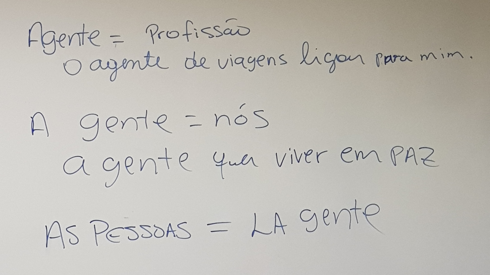
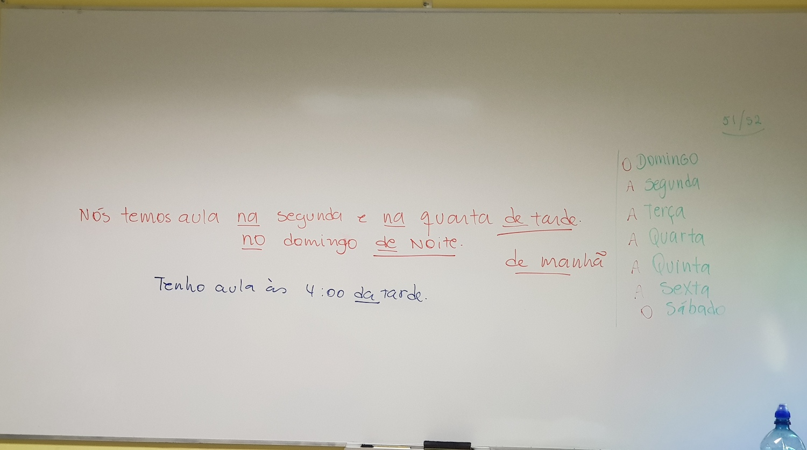

# CB1
## Profe:Betania Guedes

## Artigos Definidos

## Artigos Indefinidos

## Verbos Regulares - Irregulares

## A cidade

## Pronomes Possessivos

## Notes

| Nota          |                                       |
| ------------- |:-------------------------------------:|
| A Gente       |               | 
| De tarde      |    | 

### 
